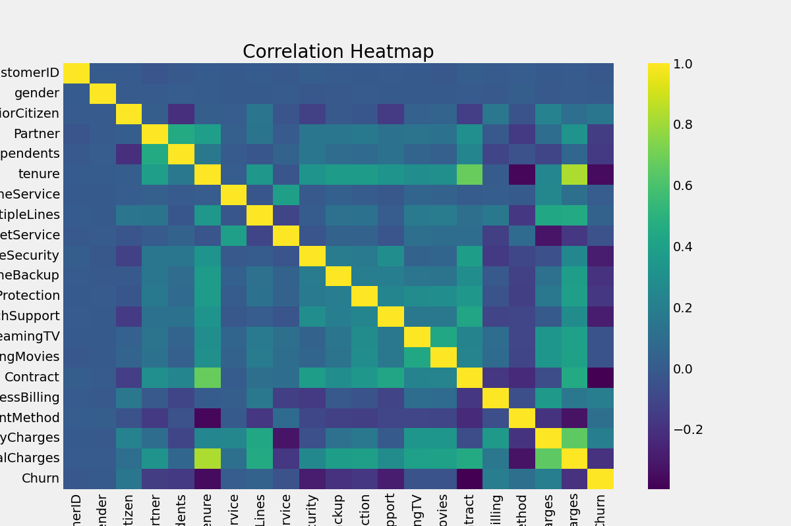

# Customer Churn Prediction using Machine Learning

## Project Overview
Customer churn is a major challenge for telecom companies. This project builds a machine learning model to predict which customers are likely to leave the service so businesses can take proactive retention actions.

## Objective
* Predict customer churn using machine learning
* Identify factors influencing churn
* Provide business insights to improve retention

## Dataset
The dataset contains **7,043 telecom customers** with features such as:
* Customer demographics
* Contract type
* Internet service
* Monthly charges
* Payment methods
* Customer tenure
Target Variable: **Churn (Yes / No)**

## Machine Learning Models Used
* Logistic Regression
* Decision Tree
* Random Forest
* Gradient Boosting
* KNN
* SVM

## Results
Best performing models:
 **Random Forest**
 **Gradient Boosting**

Model accuracy: **~79%**

## Visualizations
### Customer Churn Distribution

### Correlation Heatmap

### Feature Importance

### Confusion Matrix

## Technologies Used
* Python
* Pandas
* NumPy
* Scikit-learn
* Matplotlib
* Seaborn
* Jupyter Notebook

## Author
Shiva Sai
Aspiring Data Analyst | Data Scientist | GenAI Enthusiast
